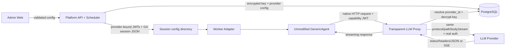

# GA 多租户透明 LLM 凭证代理设计

日期：2026-07-27  
状态：已实施并验证

## 1. 背景

GenericAgent（GA）已经完整实现 Agent 执行、Session 选择、OpenAI/Anthropic 协议、Responses API、SSE、重试、mixin 故障转移、工具调用和历史管理。Tenant Platform 的职责是增加管理员配置、多租户隔离、Worker 生命周期、策略与凭证安全，不应复制 GA 的 LLM 协议栈。

当前实现存在以下结构性问题：

1. Scheduler 生成 token-only `mykey.py`，Worker 又可能从 `/v1/config/mykey.py` 拉取含明文上游 Key 的配置并覆盖前者。
2. Platform 和 Worker 各自维护一套 `mykey.py` 生成器，字段、默认值和 Python 字面量行为已经漂移。
3. LLM Proxy 重新构造协议路径、鉴权头和整包响应，只覆盖 GA 能力的子集，丢失 Responses、SSE、Claude beta headers 和 Bearer 型 Claude 中转。
4. capability token 携带 Provider/模型声明，但 Proxy 没有校验这些声明，也按“当前默认 Provider”而非 token 绑定的 Provider 路由。
5. GA Session 字段与上游 Transport 字段混在一个结构中，导致 `proxy`、`verify`、`connect_timeout` 作用在 Worker 到本地 Proxy，而非 Proxy 到真实上游。

本设计采用干净切换，不保留明文下发或旧协议类型的兼容 shim。

## 2. 目标

1. GA Core 源码保持不变，继续作为唯一 Agent 和 LLM 协议实现。
2. 真实上游 API Key 只存在于 Platform 数据库密文和 LLM Proxy 内存中。
3. Worker 只持有作用域受限、可撤销的 Provider capability token。
4. 完整保留 GA 的 NativeOAI、NativeClaude、Responses、SSE、mixin 和原生 headers。
5. Provider、模型和路由在 Proxy 入口被强制绑定，不能依赖 Worker 自律。
6. 管理端字段与实际运行语义一一对应；无沉默忽略、无隐式 fallback。
7. 配置、Proxy、Worker、GA Core 的职责边界可独立测试和升级。

## 3. 非目标

1. 不实现统一 OpenAI/Anthropic payload 转换。
2. 不在 Platform 中实现第二套 Agent、Session、重试或工具循环。
3. 不引入模型响应缓存、计费、限流或负载均衡算法。
4. 不允许 Worker 直接持有真实上游 Key。
5. 不保留 `/v1/config/mykey.py` 明文配置下载兼容路径。

## 4. 方案选择

### 4.1 采用：透明凭证代理

GA 负责生成完整 HTTP 请求；Proxy 只执行：

- capability token 验证；
- Provider/模型/路由约束；
- 上游 URL 重写；
- 敏感 header 清理；
- 真实凭证注入；
- 响应状态、header 和 body/SSE 转发。

实现采用 Go 标准库 `net/http/httputil.ReverseProxy` 的 `Rewrite`、`ModifyResponse`、`ErrorHandler` 和 streaming flush 机制。

### 4.2 拒绝：协议感知网关

完整重写 OpenAI/Anthropic/Responses/SSE 会形成第二套协议栈。GA 新增 header、beta、endpoint 或事件类型时，Platform 必须同步修改，长期必然漂移。

### 4.3 拒绝：Worker 直连上游

该方案最接近 GA 单机模式，但真实 Key 会进入租户 Worker，不满足隔离和最小权限原则。

## 5. 总体架构



## 6. 职责边界

### 6.1 Platform/Admin

- 验证、加密并存储 Provider 配置。
- 选择默认 Provider 和启用的 fallback Providers。
- 在 Worker 创建及任务边界生成 Provider-bound JWT。
- 生成结构化 GA Session 配置。
- 原子更新 Worker 配置并撤销旧 JTI。
- Provider revision 不匹配时淘汰旧 Worker。

Platform 不解析或转换模型请求/响应。

### 6.2 LLM Proxy

- 校验 JWT 的签名、类型、issuer、audience、subject、时间和 JTI。
- 使用 token 中的 `provider_id` 查询 Provider；禁止读取“当前默认 Provider”替代 token 选择。
- 校验 Provider active、revision、provider_type 和 model。
- 校验入站路径与 Provider 协议匹配。
- 有界读取请求体，仅解析顶层 `model` 做 claim 比对；转发时使用原始 bytes。
- 按协议 header allowlist 转发 GA headers，注入真实凭证。
- 成功响应透明 streaming；错误响应脱敏。

Proxy 不修改 LLM payload，不执行重试，不累计成功响应。

### 6.3 Worker Adapter

- 管理 GA 进程、session、策略、checkpoint、取消、输出限制与任务生命周期。
- 从 session-scoped config directory 加载 token-only 配置。
- 在任务边界检测配置版本并调用现有 `agent.load_llm_sessions()`；不修改 GA Core。
- 绝不访问 Platform 的明文 Provider 配置接口。

### 6.4 GA Core

保持现状，继续负责：

- `resolve_session()` 和 Native Session 类型选择；
- request payload、tools、thinking、prompt cache 和 protocol headers；
- Responses/chat/messages endpoint 选择；
- SSE/JSON 解析；
- retry、mixin、history 和 Agent loop。

## 7. Provider 数据模型

现有扁平 `LLMProviderConfig` 拆分为两个明确结构。

### 7.1 GASessionConfig

仅包含 GA 行为字段：

```text
thinking_type                 optional enum: adaptive|enabled|disabled
thinking_budget_tokens        optional positive int
reasoning_effort              optional enum: none|minimal|low|medium|high|xhigh|max
temperature                   optional float; 0 is meaningful
max_tokens                    optional positive int
context_win                   optional positive int
trim_keep_prefix              optional non-negative int
max_retries                   optional non-negative int; 0 is meaningful
read_timeout                  optional int >= 5
stream                        optional bool; default true
api_mode                      optional enum: chat_completions|responses
fake_cc_system_prompt         optional bool; NativeClaude only
user_agent                    optional non-empty string
service_tier                  optional enum: auto|default|priority|flex
omit_thinking                 optional bool
extra_sys_prompt              optional string with configured size limit
```

数字字段使用指针或等价 presence 类型，保留“未配置”和显式零值差异。

删除：

- `top_p`：当前 GA Core 不消费；
- 重复 `timeout` UI 字段；
- `extra_sys_prompt_file`：Web 配置的 Worker 文件路径不可移植且可能导致任意文件读取；
- GA Session 中的 `proxy`、`verify`、`connect_timeout`：它们属于上游 transport。

### 7.2 ProviderTransportConfig

仅由 Proxy 消费：

```text
auth_mode                       enum: auto|bearer|x_api_key
proxy_url                       optional absolute http/https URL
tls_verify                      optional bool; default true
connect_timeout_seconds         optional positive int
response_header_timeout_seconds optional positive int
```

`auth_mode=auto` 与 GA NativeClaude 行为一致：真实 Key 以 `sk-ant-` 开头时使用 `x-api-key`，否则使用 Bearer。管理员可为特殊中转显式覆盖。

### 7.3 Provider revision

Provider 增加单调递增 `revision BIGINT NOT NULL DEFAULT 1`。任何会改变路由或 GA 行为的更新都递增 revision：

- provider type；
- base URL；
- model；
- session config；
- transport config；
- state。

仅 API Key 密文轮换不递增 routing revision，使现有 token 能继续使用同一 Provider ID 的新 Key。

## 8. Worker 配置格式

### 8.1 结构化 JSON

Scheduler 写入：

- `mykey.runtime.json`：完整变量名到配置字典的 JSON object；
- `mykey.py`：固定 loader，无动态字段拼接。

固定 loader：

```python
import json as _json
from pathlib import Path as _Path

_config = _json.loads(
    _Path(__file__).with_name("mykey.runtime.json").read_text(encoding="utf-8")
)
globals().update(_config)
del _config
```

所有临时符号以下划线开头，GA `_load_mykeys()` 会忽略。JSON 由标准 encoder 生成，消除 Python 布尔字面量、引号注入和手工格式化漂移。

`mykey.runtime.json` 顶层包含 `_platform_runtime` 元数据，字段为 `credential_generation`、`config_checksum` 和 `routing_snapshot_id`。该 key 以下划线开头，GA 会忽略；Worker 用它完成任务前的配置握手。

### 8.2 Session 变量

每个 Provider 生成一个稳定变量名：

```text
platform_native_oai_provider_<id>_config
platform_native_claude_provider_<id>_config
```

变量名继续触发 GA 原生 `resolve_session()` 逻辑，不新增 `type` 字段。

每个配置只包含：

- `name`：稳定的 `provider-<id>` runtime name，避免管理员改名破坏 history；
- `apikey`：该 Provider 的 capability JWT；
- `apibase`：LLM Proxy base URL；
- `model`；
- `GASessionConfig` 字段。

### 8.3 Mixin

启用 Provider 列表生成原生 `mixin_config`：

- 默认 Provider 排第一；
- 其余 active Provider 按稳定 `id` 升序；
- 每个 Provider 使用独立 JWT；
- `llm_nos` 引用稳定 runtime name；
- max retries/base delay 使用平台明确配置或 GA 默认，不写死魔法值。

GA 自己执行 fallback；Proxy 不实现 Provider failover。

### 8.4 原子写入

1. 写 `mykey.runtime.json.tmp`；
2. flush + close；
3. 原子 rename 为目标 JSON；
4. `mykey.py` loader 仅在缺失或内容版本变化时原子写入。

文件权限为 owner-only；Windows 通过目录 ACL/容器挂载保证隔离。

## 9. Capability JWT

采用 `github.com/golang-jwt/jwt/v5`，仅允许 HS256。签名密钥最少 32 bytes，并由 secret manager 提供。

### 9.1 JOSE header

```json
{
  "alg": "HS256",
  "typ": "ga-llm-cap+jwt"
}
```

### 9.2 Claims

```json
{
  "iss": "ga-platform",
  "aud": ["ga-llm-proxy"],
  "sub": "<session_key>",
  "jti": "<128-bit random id>",
  "iat": 0,
  "nbf": 0,
  "exp": 0,
  "provider_id": 123,
  "provider_revision": 7,
  "provider_type": "native_oai",
  "model": "gpt-5.4",
  "policy_version": "..."
}
```

### 9.3 校验不变量

Proxy 必须：

- 固定允许 HS256，不从 token 自由选择算法；
- 校验 `typ`、issuer、audience、subject 非空；
- 校验 `iat`、`nbf`、`exp`，仅允许小范围 clock skew；
- 校验 JTI 未撤销；
- 校验 Provider ID、revision、type、model 与数据库一致；
- 校验请求 path 和 body model 与 claims 一致。

任何失败均拒绝，不 fallback 到默认 Provider。

### 9.4 生命周期

- Scheduler 在 Worker 创建时签发 token set，并将 `credential_generation=1` 写入 runtime JSON。
- 每个任务开始前检查剩余 TTL；低于 refresh threshold 时，为相同 routing snapshot 签发新 token set，写入 generation `N+1` 和新的 checksum。
- Scheduler 调用新增的 unary Worker RPC `ReloadCredentials(generation, checksum)`。Worker 读取 runtime JSON，验证 generation/checksum，调用现有 `agent.load_llm_sessions()`，并仅在成功后回传已加载 generation；稳定 session name 使 GA 保留 backend history。
- Reload RPC 失败时，Worker 保留旧的内存 Session，Scheduler 不撤销旧 JTI，并中止本次任务投递；不得把配置加载失败降级成继续执行。
- 收到 Reload 成功确认后，Scheduler 才撤销上一 generation 的 JTI。Worker 退出、取消、新会话或 Provider 禁用时立即撤销该 Worker 的全部 JTI。
- 部署配置必须满足 `token_ttl >= max_task_wall_clock + refresh_skew`；Platform 启动时校验该不变量，并以独立的 `max_task_wall_clock` 对任务设置硬上限。
- 撤销记录写入 PostgreSQL `llm_capability_revocations(jti_hash BYTEA PRIMARY KEY, expires_at TIMESTAMPTZ NOT NULL)`；Proxy 每次鉴权查询该表，按 `expires_at` 定期清理。数据库只保存 JTI 哈希，不保存原始 token。

## 10. Transparent Reverse Proxy

### 10.1 入站路由

允许：

```text
native_oai    POST /v1/chat/completions
native_oai    POST /v1/responses
native_claude POST /v1/messages
```

可保留 `/chat/completions` alias，但内部 canonicalize 到 `/v1/chat/completions`。其他 method/path 返回 404/405。

### 10.2 URL 重写

重写逻辑与 GA `auto_make_url()` 建立契约：

- Base URL 已含 `/vN` 时，在其后追加 endpoint；
- Base URL 已以完整 endpoint 结尾时不重复追加；
- Base URL 以 `$` 标记时使用去除 `$` 后的精确 URL；
- 保留 GA 入站 query，例如 Claude `beta=true`；
- Provider URL 中原有 query 与入站 query 使用确定性合并规则；冲突时拒绝而非静默覆盖。

### 10.3 Header 策略

统一删除：

```text
Authorization
X-Api-Key
Cookie
Forwarded
X-Forwarded-*
Proxy-Authorization
Connection 及其声明的 hop-by-hop headers
```

允许 GA 协议 headers：

```text
Content-Type
Accept
User-Agent
Anthropic-Version
Anthropic-Beta
Anthropic-Dangerous-Direct-Browser-Access
X-App
X-Claude-Code-Session-Id
X-Stainless-*
OpenAI-Beta
Originator
```

Proxy 最后注入真实鉴权，Worker 无法覆盖。

### 10.4 请求体

- 保持当前 4 MiB 或配置化上限；
- 有界读取一次；
- 用最小 JSON struct 读取顶层 `model`；
- 校验后用原始 bytes 构造上游 body；
- 不 marshal 整个 payload，避免字段丢失或重排。

### 10.5 Response 和 streaming

- 2xx 响应不读取完整 body；直接 streaming；
- `Content-Type: text/event-stream` 使用及时 flush；
- 不设置会截断 SSE 的 30 秒 Server `WriteTimeout`；
- client disconnect 通过 request context 取消上游；
- Proxy 不自动重试 POST；GA 保持唯一 retry owner。

非 2xx：

- 保留真实 status；
- 允许 `Retry-After` 和上游 request-id；
- 替换 body 为稳定、无账户信息的错误结构；
- 服务端记录脱敏后的 Provider ID、status 和 request-id。

## 11. Transport 与 SSRF 防护

### 11.1 Transport cache

按 `provider_id + transport_config_hash` 缓存 `http.Transport`：

- 复用 TCP/TLS 连接；
- Provider 更新后生成新 transport；
- 旧 transport 关闭 idle connections；
- 不为每次请求复制大对象或创建新 client。

### 11.2 上游 URL 安全

默认：

- 只允许 absolute HTTPS URL；
- 禁止 userinfo、fragment 和空 host；
- DNS/IP 解析后拒绝 loopback、link-local、multicast、metadata 和未授权私网地址；
- redirect 默认关闭，避免重定向绕过 SSRF 校验。

本地模型或企业内网通过部署级 allowlist 开启：

```text
LLM_PROXY_ALLOWED_UPSTREAM_CIDRS
LLM_PROXY_ALLOW_HTTP_HOSTS
```

Web Provider 配置不能自行放宽该 allowlist。

### 11.3 TLS

`tls_verify=false` 必须显式配置，并产生管理员审计事件和运行时 warning。生产策略可全局禁止关闭 TLS 校验。

## 12. API 与 Web

### 12.1 API

- OpenAPI enum 统一为 `native_oai|native_claude`；
- Provider create/update 使用分离的 `session_config` 和 `transport_config`；
- 所有字段做后端权威校验；
- API Key update 支持省略，省略表示保留现有密文；
- 删除 `GET /v1/config/mykey.py`；
- Provider reply 永不返回 Key、ciphertext 或 key version；
- 增加 revision 和明确的 validation error code。

### 12.2 Web

- 仅展示实际支持字段；
- protocol-specific 字段按 Provider 类型显示；
- `stream` 默认 true，不再被后端强制 false；
- 数值 input 有 min/max/step；显式 0 不用 `value || ''` 吞掉；
- 增加编辑 Provider 能力；Key 留空表示不轮换；
- transport 设置与 GA 行为设置分组显示；
- auth mode 默认 auto，特殊中转可覆盖；
- 删除 Top P、重复 Timeout 和 Extra Sys Prompt File。

## 13. 错误模型与可观测性

稳定错误码：

```text
CAPABILITY_INVALID
CAPABILITY_EXPIRED
CAPABILITY_REVOKED
CAPABILITY_AUDIENCE_MISMATCH
PROVIDER_NOT_FOUND
PROVIDER_DISABLED
PROVIDER_REVISION_MISMATCH
PROVIDER_TYPE_MISMATCH
MODEL_MISMATCH
ROUTE_NOT_ALLOWED
UPSTREAM_URL_REJECTED
UPSTREAM_CONNECT_FAILED
UPSTREAM_TIMEOUT
UPSTREAM_ERROR
```

日志字段：

```text
trace_id
jti_hash
session_hash
provider_id
provider_revision
route
status
latency_ms
request_bytes
response_bytes
upstream_request_id
```

禁止记录：

- capability token；
- API Key；
- 完整 request/response body；
- Provider ciphertext；
- 用户 prompt。

## 14. 数据库迁移

一次事务迁移：

1. 增加 `session_config JSONB NOT NULL DEFAULT '{}'`；
2. 增加 `transport_config JSONB NOT NULL DEFAULT '{}'`；
3. 增加 `revision BIGINT NOT NULL DEFAULT 1`；
4. 创建 `llm_capability_revocations` 表及 `expires_at` 清理索引；
5. 将旧 flat config 中 GA 行为字段迁入 session config；
6. 将 proxy/verify/connect timeout 迁入 transport config；
7. 验证所有现有行可解码并通过新校验；
8. 删除旧 `config` 列；
9. 约束 provider type 只允许 native types。

迁移遇到未知字段或无效值必须失败并列出 Provider ID，不做沉默丢弃。

## 15. Clean Cutover 顺序

1. 停止 Platform、LLM Proxy 和 Worker；
2. 备份数据库与 Provider 配置；
3. 执行数据库迁移和数据校验；
4. 同时部署新版 Platform、Proxy、Worker 和 Web；
5. 撤销或使旧 token 签名域失效；
6. 删除旧 `/v1/config/mykey.py` 路由、`GenerateMykeyPy` 和 Worker `config_fetcher`；
7. 清理旧 session config，按需重建 Worker；
8. 运行 contract、security、integration 和 smoke 验证；
9. 验证后恢复流量。

不支持混跑旧 Worker 与新 Proxy。

## 16. 测试策略

### 16.1 配置契约

每个测试都生成真实 runtime JSON/loader，然后通过实际 GA Core 导入：

- `resolve_session()` 返回正确 Native Session；
- 所有字段值与数据库配置一致；
- bool、引号、反斜杠、Unicode 和显式零值正确；
- 未配置字段使用 GA 自身默认；
- mixin 引用正确且顺序稳定；
- 配置中不存在真实 Key。

### 16.2 JWT

覆盖：

- 正确 token；
- 错误 alg/type/issuer/audience/subject；
- expired/not-before/clock skew；
- revoked JTI；
- Provider ID/revision/type/model mismatch；
- Proxy 重启后撤销仍有效；
- 旧 token 在新 token 加载成功后失效。

### 16.3 Proxy 行为

使用本地 fixture upstream 端到端覆盖：

- OpenAI chat completions；
- OpenAI Responses；
- Claude x-api-key；
- Claude Bearer relay；
- Anthropic beta、1M、UA 和 Stainless headers；
- exact endpoint 和 `/v1` URL 拼接；
- SSE 首块在 upstream 完成前到达 Worker；
- client cancel 取消上游；
- 429/5xx status 与 Retry-After；
- 不自动重放 POST；
- model/path/header 注入被拒绝；
- private/metadata/redirect SSRF 被拒绝；
- logs/config/process env 无真实 Key 或 token。

### 16.4 Worker/GA 集成

覆盖完整链路：

```text
Scheduler -> session config -> Worker -> real GA -> Proxy -> fixture provider
```

至少包含 NativeOAI、Responses、NativeClaude、stream、mixin fallback、token refresh、Provider disable 和 Key rotation。

### 16.5 UI/API

- OpenAPI 与 Go/TypeScript types 一致；
- create/edit/default/disable Provider；
- conditional fields 和数值边界；
- explicit zero round-trip；
- API Key 留空保留；
- unknown fields 被明确拒绝；
- 无废弃 enum、路径或源码字符串型安全测试。

## 17. 验收标准

1. Worker 文件、环境、日志和进程内存不包含真实上游 Key。
2. `/v1/config/mykey.py` 和明文 generator 不再存在。
3. GA Core 文件无业务修改；Worker 最终仍调用原生 `GenericAgent.put_task()`。
4. Chat、Responses、Claude、SSE 和 mixin 端到端通过。
5. capability token 不能跨 Provider、模型、revision 或 audience 使用。
6. Provider 默认切换不改变已绑定 Worker 的路由；新 Worker 使用新默认。
7. Key 轮换无需向 Worker 下发真实 Key，且不破坏同 Provider 的有效会话。
8. Proxy 不整包缓存成功响应，不自动重试 POST，不使用 30 秒 WriteTimeout 截断 SSE。
9. UI 所有字段均能 round-trip 并在实际 GA Session 或 Proxy transport 中生效。
10. Go、Python、Web、contract、security、integration 和 smoke 验证全部通过。

## 18. 采用的成熟实践

- Go `net/http/httputil.ReverseProxy`：成熟的 transparent reverse proxy、rewrite 和 streaming 基础。
- RFC 8725：JWT algorithm、issuer、audience、claim trust 和 explicit typing 最佳实践。
- Anthropic Messages streaming：SSE 事件必须增量转发，长响应不应整包缓存。
- GA Core 现有 `resolve_session()`、`auto_make_url()`、Native Session 和 `load_llm_sessions()` 作为本地行为契约，不复制实现。

参考：

- https://pkg.go.dev/net/http/httputil
- https://www.rfc-editor.org/rfc/rfc8725.html
- https://platform.claude.com/docs/en/build-with-claude/streaming
- https://developers.openai.com/api/reference/resources/chat/subresources/completions/streaming-events/
